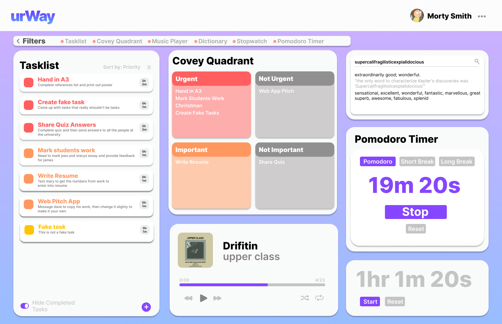

# DECO2017 A3 WEB APP - RDAY6770

## Introduction

This Web app is designed to help people manage their study sessions. The Web app is called urWay as we want students to be able study "urWay" instead of someone elses way. The app focuses on a clean and minimal design in order to improve readability and userability. The web app uses mostly neutral colours with splashes of colour to indiciated important peices of informance such as priority and so on. The features of urWau are:

Tasklist: The tasklist allows students to add tasklist with a Name, Due Date, Priority rating (Low, Medium, High) and a Esimtated time to completion (Hours and Minutes). This allows students to keep track of different tasks and helps them prioritise which task they need to do first

Covey Quadrant: This allows student to further manage their task by organsing their tasks into seperate categories.

Music Player: Allows for less distractions for students as they dont have to have their music open on another app or device

Acronym Generator: This allows the user to input a sentence of words and it generators a mnemonic

Pomodoro Timer: Pomodoro timer allows for users to set specific times of study and break which allows for better focus

Stopwatch Timer: This allows for students to keep track of other tasks that need a seperate timer

## urWay went through two different iterations and changes were made to better ui in order to give the user a better user experience.

The following Image shows a picture of the original design of the web app, a few change were made from the original to make the final app more effective and user centered. This changes include changing the dictionary feature to a acronym feature, changing the design of the Pomodoro timer and stopwatch, changing how the music player is embedded into the web app and removing the filter function. Another consideration as the removal of the account feature as while we felt this feature could help the user the feasability of the feature was not there.

The main colours of urWay were chosen to be Purple and Blue as these colours are seen as "non-threatening colors that can seem conservative and traditional. Blue calls to mind feelings of calmness or serenity. It is often described as peaceful, tranquil, secure, and orderly. Blue is often seen as a sign of stability and reliability". This was important for the design as we wanted to create a enviroment were the user experience was not another point of stress for the user.

# Design Princples

In order to ensure urWay was easy simple to use we emploted design princples such as:

Repeition: We used the same colour and design for our buttons across the web app which allows users to easily make connections and learn how the web app works. For example if a user clicks on a purple button to submit a form the user will make a mental note that purple boxes are buttons that can be clicked on. To further enhance this we added a hover function so that when users hover over a button they will receive instant feedback from the button which further increase the readability and useability of the web app.

Balance: Balance is used to ensure a clean, minimal and asethetic design. The three main columuns create a visually appealing interface. This is needed as the main cards (features) are different heights and if placed unevenly creates a unpleasant visually experience for the user.

Emphasis: Emphasis is used by different colours to grab the users attention. This is shown through the Tasklist priority rating and the covey Quadrant. The strong red and orange colours draw the users attention to those areas. This allows for the users attention to be drawn to the urgent tasks that they have to complete.

Hierachuy: Hierachuy was used in all features to convey the different pieces of information in order of importance. This is shown through the different peices of information on the tasklist. This idea is also further developed and used to the different feature of the web app. For example we read from left to right, up to down. The features were designed to be in order of importance from left to right, up to down. The most important feature would be the tasklist so this was placed on the left and takes up the most visual space.

# Self reflection:

While the Web app is visually appealing, clean and address the breif there are still improvements that could be made to the app. This include

The task list items could be redesigned to ensure the width is the same for all items to allow for better asethetics and readability.

The ability to filter the features was removed would allow for a better viewing experience espically when viewing from a mobile phone as instead of scrolling to the bottom features users could remove the ones they arent using.

Allowing for users to create an account would allow users to save their information and session and prevent them from having to re-enter their tasks everytime they open the Web app

In order to make the Web App responsive changes needed to be made to the code, this could have been done to start with to improve the work flow and time management.

## References

How I built my Pomodoro Clock app, and the lessons I learned along the way(2018, April 9). Retrieved 3 June 2022, from FreeCodeCamp.org
website: https://www.freecodecamp.org/news/how-i-built-my-pomodoro-clock-app-and-the-lessons-i-learned-along-the-way-51288983f5ee/

Stopwatch in javascript—Jsfiddle—Code playground. (n.d.). Retrieved 3 June 2022, from https://jsfiddle.net/2vwcd3a8/
